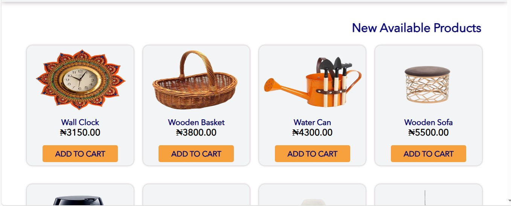
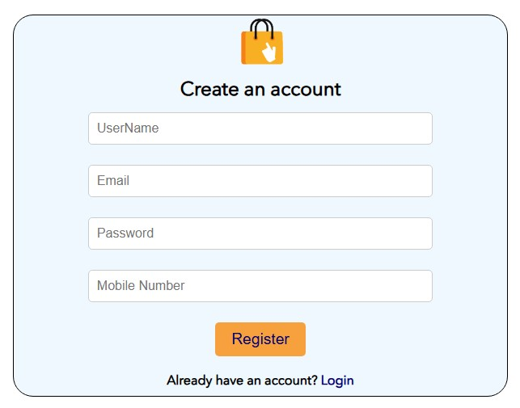
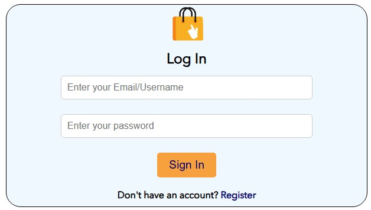
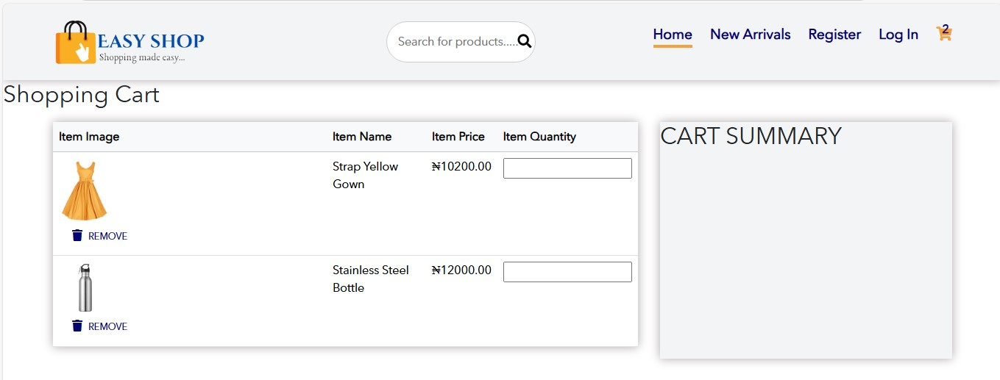

<h1> <b> Simple E-commerce Website </b> </h1>

<h2> <b> Project Overview </b> </h2>

This ongoing project is a simple e-commerce website built using HTML, CSS, JavaScript, and PHP. The website is designed to showcase products, provide a detailed product information like category, name and price, and allow users to add items to their shopping cart.

<h2> <b> Features </b> </h2>

1. Product Listing: Displays products under different categories with their names and prices.
2. Shopping Cart: Users can add items to the cart and view a summary before checkout.
3. Account: Users can either register or log in.

<h2> <b> Technologies Used </b> </h2>

1. <b> HTML5 </b> for structure
2. <b> CSS3 </b> for styling
3. <b> PHP </b> for server-side logic and database handling
4. <b> JavaScript </b> for functionality
5. <b> MySQL </b> (via <b> XAMPP </b> for the local database)

<h2> <b> Project Structure </b> </h2>

- <b> index.php: </b> The homepage where products are displayed.

<h2> <b> Screenshots </b> </h2>

1. HomePage
- 

2. HomePage(Product List)
- 

3. HomePage(Product List)
- 

4. New Arrivals Page
- 

5. Registration Page
- 

6. SignIn Page
- 

7. Shopping Cart Page
- 

<h2> <b> Setup Instructions </b> </h2>

1. Clone the repository to your laptop, system or computer by running this: 
- git clone https://github.com/Temitope1606/Simple-e-commerce-website.git
2. Set up the database:
  - Make sure you have XAMPP or WAMP running.
  - Place the cloned repository in the htdocs folder (for XAMPP) or the www folder (for WAMP).
  - Open your browser and run localhost/foldername/auth.php to create the necessary database and tables.
  - Update the database connection settings (like database name and table names) in the auth.php file.
3. Access the website
  - Run this on your browser: localhost/foldername/index.php

