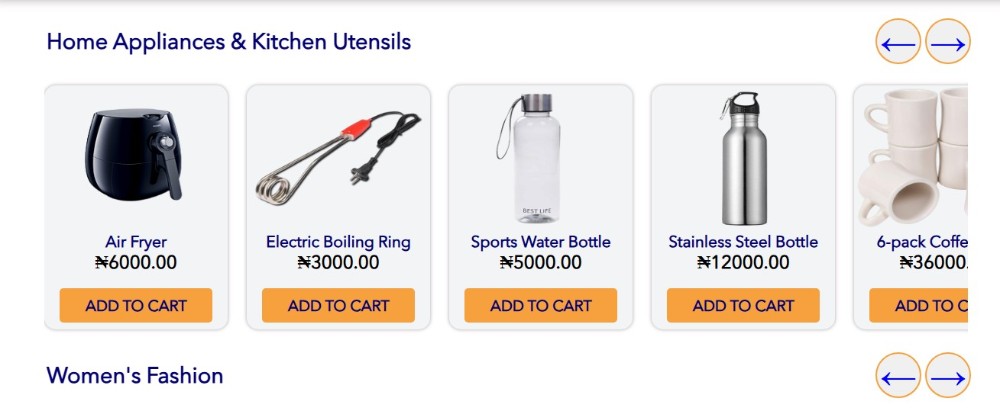
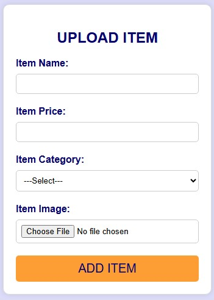

# Simple E-commerce Website 

# Project Overview

This ongoing project is a simple e-commerce website built using HTML, CSS, JavaScript, and PHP. The website is designed to showcase products, provide a detailed product information like category, name and price, and allow users to add items to their shopping cart.

# Features

1. **Product Listing:** Displays products under different categories with their names and prices.
2. **Shopping Cart:** Users can add items to the cart and view a summary before checkout.
3. **Account:** Users can either register or log in.
4. **Database Integration:** Items are stored in a database and retrieved to be displayed on the pages.


# Technologies Used

1. **HTML5** for structure
2. **CSS3** for styling
3. **PHP** for server-side logic and database handling
4. **JavaScript** for front-end functionality
5. **MySQL** (via **XAMPP** for the local database)


# Project Structure

- **index.php:** The homepage where products are displayed.
- **new-arrival.php:** The page where other products or newly arrived products are displayed.
- **shopping-cart.php:** The page where products or items added to cart are shown.
- **search_result.php:** The page is for displaying the search result of products or items.
- **upload-item.php:** The page is for uploading or adding items to the database.
- **add_to_cart.php:** This file contains the codes that'll run when 'ADD TO CART' button is clicked.
- **sign-up.php:** Registration page.
- **sign-in.php:** Login page.
- **eCommerce.php:** This file contains the necessary php functions and also handles database connection.
- **auth.php:** This file contains the codes for authentication like creating database, tables.
- **script.js:** This javaScript file handles various front-end functionalities in the website. 
- **assests/css:** This folder contains the css files(main.css, style.css, upload-item.css) for styling the homepage, new arrivals page and upload item page. 
- **auth/sign-up-in.css:** This css file is for styling the registration and login page. 


# Screenshots

1. HomePage
- 

2. Product List(HomePage)
- 

3. Product List(HomePage)
- 

4. New Arrivals Page
- 

5. Registration Page
- 

6. SignIn Page
- 

7. Shopping Cart Page
- 

8. Upload Item Page
- 


# Setup Instructions

1. Clone the repository to your laptop, system or computer by running this: 
```bash
 git clone https://github.com/Temitope1606/Simple-e-commerce-website.git
```
2. Set up the database:
  - Make sure you have XAMPP or WAMP running.
  - Place the cloned repository in the htdocs folder (for XAMPP) or the www folder (for WAMP).
  - Open your browser and run localhost/foldername/auth.php to create the necessary database and tables.
  - Update the database connection settings (like database name and table names) in the auth.php file.
3. Access the website
  - Run this on your browser: localhost/foldername/index.php


# Future Improvements 
- **Payment Integration:** Add functionality for users to pay for products in the cart.
- **User Profiles:** Allow users to manage their profiles.
- **Order Management:** Store and manage user orders in the database.